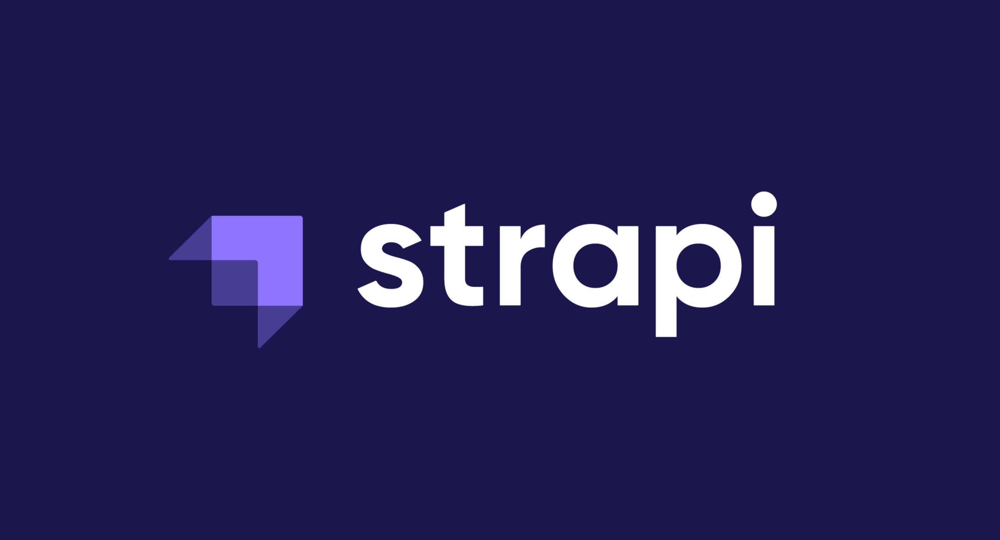

# Movie Custom Web API

Welcome To My Custom  Web API Made By Strapi By Watuulo-Richard



## Features

- HTML
- Javascript

## Usage

This website is built with [Plain HTML & Javascript]

In order to customize this website, you need to install [Node.js](https://nodejs.org/en/). Then, clone this repository and run:

To create your strapi files for changes, run:

```bash
npx create-strapi-app@latest my-strapi-project --quickstart
```

To watch your strapi files for changes, run:

```bash
npm run develop
```

You can add Bootstrap variables to the `bootstrap.scss` file. You can look at the file `node_modules/bootstrap/dist/scss/_variables.scss` for a list of all the variables. Do NOT edit the `variables.scss` file directly, as it will be overwritten when you update Bootstrap.
